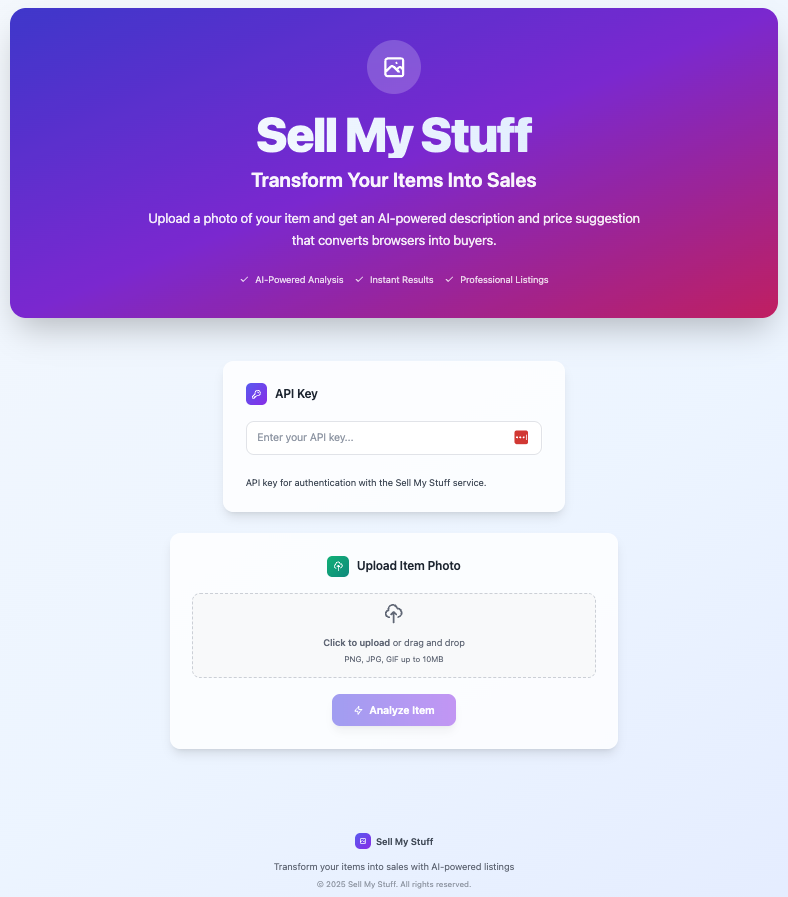

# Sell My Stuff

Sell My Stuff is a web application that helps you create compelling product listings by uploading a photo and receiving AI-powered descriptions and price suggestions.



## Features

- 📸 Upload any photo (JPG, PNG, GIF up to 10MB)
- 🤖 AI-powered item analysis and description generation
- 💰 Smart price suggestions based on item analysis
- 🔑 Secure API key authentication
- 📋 Copy-ready listing text for easy posting
- 🎨 Modern, responsive UI with drag-and-drop upload
- ⚡ Fast, efficient image processing
- 🔒 Secure - API keys are user-provided and not stored

## Getting Started

### 1. Clone the repository
```bash
git clone https://github.com/breakintocloud/hackathon-sell-my-stuff-frontend.git
cd hackathon-sell-my-stuff-frontend
```

### 2. Install dependencies
```bash
npm install
```

### 3. Start the development server
```bash
npm run dev
```

Open [http://localhost:5173](http://localhost:5173) in your browser.

### 4. Build for production
```bash
npm run build
```

This will create a `dist` folder with the production-ready build of your application.

### 5. Preview the production build
```bash
npm run preview
```

This will serve the production build locally for testing before deployment.

## Configuration

The app can be configured using environment variables. See [FRONTEND_CONFIG.md](./FRONTEND_CONFIG.md) for detailed configuration options.

### Environment Variables
- `VITE_API_BASE_URL` - The base URL of your API backend (default: `http://localhost:8000`)

## Deployment

This frontend is designed to be deployed as a static site to services like:
- AWS S3 + CloudFront
- Vercel
- Netlify
- GitHub Pages

Simply build the project and deploy the `dist` folder contents.

## Usage
1. Enter your API key for the Sell My Stuff backend service
2. Upload a photo of the item you want to sell
3. Click **Analyze Item**
4. View the AI-generated description and price suggestion
5. Copy the listing text to use on your preferred marketplace

> **Note:** Your API key is only used to authenticate with the Sell My Stuff backend service. It is never stored in the application.

## Tech Stack
- [React](https://react.dev/) - Frontend framework
- [Vite](https://vite.dev/) - Build tool and dev server
- [Tailwind CSS](https://tailwindcss.com/) - Utility-first CSS framework
- [React Markdown](https://github.com/remarkjs/react-markdown) - Markdown rendering

## License
MIT
